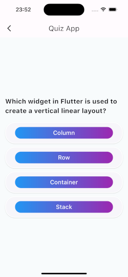
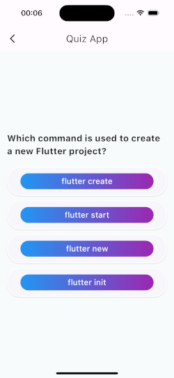
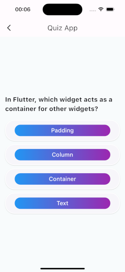

# Flutter Quiz App


## 🔨 Construction

* J'ai commencé par refaire l'exercice de quiz, en créant une liste de quiz codée en dur.
* Une fois cela réussi, j'ai enchaîné avec la page de résultats et ses statistiques. Après avoir finalisé l'exercice du quiz, j'ai poursuivi avec la partie 'fetch', récupérant les questions depuis l'API. 
* Une fois cette étape terminée, j'ai travaillé sur la persistance des données en utilisant SharedPreferences. 
* Ensuite, j'ai tenté d'implémenter une base de données, mais je me suis heurté à une erreur que je n'ai pas eu le temps de résoudre. Le problème semblait provenir de la bibliothèque sqflite.


## 🕹 Functionalitées 
 
* Quiz.
* Navigation entre trois fragments.
* Télécharger les questions depuis questions.json.
* Verfication du dernier télechargement.
* Persistance avec SharedPreferences.

<br>
<br></br>

## Getting Started
To get a local copy of the project up and running, follow these simple steps.

Prerequisites
* Flutter installed on your machine.
* Dart SDK.
* An editor such as Android Studio or Visual Studio Code.

## Installation
Clone this repository and import into **Android Studio**
```bash
git clone https://github.com/edsonDeCavalho/flutter_quiz_app.git
```

Navigate to the project directory:

```bash
cd flutter_quiz_app
```

Install the dependencies:

```bash
flutter pub get
```

Ensure you have a connected device or emulator running.

```bash
flutter run
```


## License

This application is released under GNU GPLv3 (see [LICENSE](LICENSE)).
Some of the used libraries are released under different licenses.


